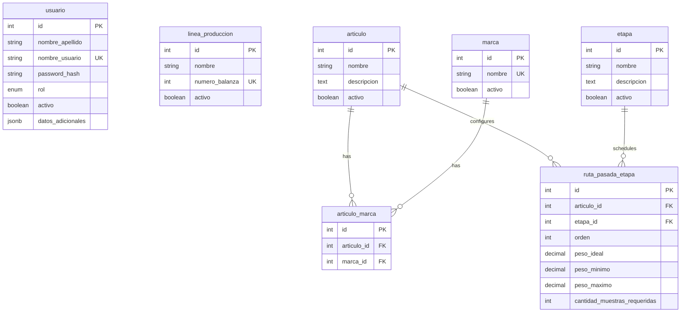

# Design: Core Domain Entities & MikroORM v7 Setup

## Technical Approach

We will define the core domain entities (`Usuario`, `LineaProduccion`, `Articulo`, `Marca`, `ArticuloMarca`, `Etapa`, `RutaPasadaEtapa`) matching schema v1.2 (`modelo_datos_control_pesaje.md`). The entities will be implemented using TS **decorators** in `src/models/` for seamless reflection, validation, and schema generation with MikroORM v7. Extensible options will map to PostgreSQL `jsonb` column types, strictly typed using TypeScript interfaces to maintain clean domain boundaries.

## Architecture Decisions

| Option | Tradeoff | Decision |
|--------|----------|----------|
| **Decorators vs EntitySchema** | Decorators couple the code to MikroORM but minimize boilerplate and auto-infer types. EntitySchema keeps classes pure but doubles code maintenance. | **Entity Decorators** directly in TS classes due to active decorator configuration. |
| **N:M Mapping (Implicit vs Explicit)** | Implicit `ManyToMany` uses a hidden table. Explicit entity `ArticuloMarca` maps a physical PK `id` and allows custom metadata. | **Explicit ArticuloMarca** entity to prevent synchronization issues with its autoincremental `id` PK. |
| **Decimal Precision Mappings** | JS `number` risks floating-point rounding errors. Using `@Property({ columnType: 'decimal(8,3)' })` and handling conversions protects precision. | **Postgres Decimal (8,3)** mapped to TS `number` (or string when precise arithmetic requires parsing). |

## Data Flow



## File Changes

| File | Action | Description |
|------|--------|-------------|
| `src/models/Usuario.ts` | Create | Entity representing system users, their role, and UI preferences metadata. |
| `src/models/LineaProduccion.ts` | Create | Entity for production lines linked to specific physical scales. |
| `src/models/Articulo.ts` | Create | Entity for base articles (products). |
| `src/models/Marca.ts` | Create | Entity for brand classifications. |
| `src/models/ArticuloMarca.ts` | Create | Explicit bridge entity for Article-Brand mapping. |
| `src/models/Etapa.ts` | Create | Entity for weighing stages. |
| `src/models/RutaPasadaEtapa.ts` | Create | Entity defining standard sequences and limits per article/stage. |
| `src/models/index.ts` | Create | Index exporter for unified model imports. |

## Interfaces / Contracts

### JSONB Metadata Structures

```typescript
export interface UsuarioMetadata {
  preferenciasInterfaz?: {
    tema?: 'claro' | 'oscuro';
    idioma?: 'es' | 'en';
  };
  configuracionBalanzaDefecto?: {
    estabilizacionMs?: number;
    taraDefecto?: number;
  };
}

export interface MuestraMetadata {
  telemetriaRaspberry?: {
    temperaturaCpu?: number;
    voltajeAlimentacion?: number;
    senalWifi?: number;
  };
  lecturasSensores?: {
    temperaturaAmbiente?: number;
    humedadRelativa?: number;
  };
  motivoFueraDeRango?: string;
}
```

### Entity Skeletons Reference

Below are the structural signatures for `ArticuloMarca` and `RutaPasadaEtapa`:

```typescript
@Entity({ tableName: 'articulo_marca' })
@Unique({ properties: ['articulo', 'marca'] })
export class ArticuloMarca {
  @PrimaryKey({ autoincrement: true })
  id!: number;

  @ManyToOne(() => Articulo, { deleteRule: 'cascade' })
  articulo!: Articulo;

  @ManyToOne(() => Marca, { deleteRule: 'cascade' })
  marca!: Marca;
}

@Entity({ tableName: 'ruta_pasada_etapa' })
@Unique({ properties: ['articulo', 'etapa'] })
export class RutaPasadaEtapa {
  @PrimaryKey({ autoincrement: true })
  id!: number;

  @ManyToOne(() => Articulo, { deleteRule: 'cascade' })
  articulo!: Articulo;

  @ManyToOne(() => Etapa, { deleteRule: 'cascade' })
  etapa!: Etapa;

  @Property()
  orden!: number;

  @Property({ columnType: 'decimal(8,3)' })
  pesoIdeal!: number;

  @Property({ columnType: 'decimal(8,3)' })
  pesoMinimo!: number;

  @Property({ columnType: 'decimal(8,3)' })
  pesoMaximo!: number;

  @Property()
  cantidadMuestrasRequeridas!: number;
}
```

## Testing Strategy

Integration tests in `tests/models.test.ts` will verify metadata discovery and schema output:

| Layer | What to Test | Approach |
|-------|--------------|----------|
| **Integration** | Entity Metadata Discovery | Test that MikroORM successfully discovers and registers all 7 entities using `orm.discover.getEntities()`. |
| **Integration** | Schema Synchronization | Use MikroORM `SchemaGenerator` to drop and recreate the DB, asserting matching column names, relationships, and constraints. |
| **Integration** | Entity CRUD & Soft Delete | Verify basic record creation, cascade rules, default `activo = true`, and retrieval. |

## Migration / Rollout

Automatic schema sync via `SchemaGenerator` will be used for Vitest test environments. Production setups will use the configured `Migrator` in MikroORM.
