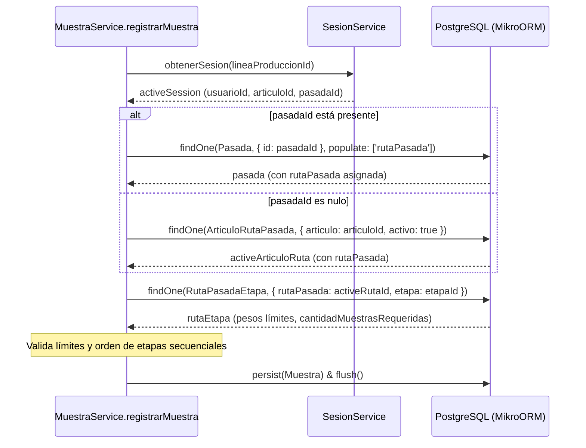

# Design: Rediseño del Modelo de Rutas

## Technical Approach
Reestructurar el modelo de base de datos desvinculando la relación directa entre `Articulo` y `RutaPasadaEtapa` (etapa de pesaje). Se introduce la entidad `RutaPasada` como agrupación de etapas, y una entidad intermedia explícita `ArticuloRutaPasada` para mapear artículos a rutas de forma trazable e histórica mediante borrado lógico.

## Architecture Decisions
| Decision | Choice | Alternatives considered | Rationale |
|----------|--------|-------------------------|-----------|
| **Uso de Entidad Intermedia Explícita** | Crear `ArticuloRutaPasada` con `activo: boolean`. | Relación N:M implícita sin auditoría. | El borrado lógico preserva la auditoría histórica de qué artículos pertenecían a qué rutas en pesajes pasados. |
| **Desasociación en RutaPasadaEtapa** | Mapear `RutaPasadaEtapa` a `RutaPasada` en lugar de `Articulo`. | Mantener `Articulo` en la etapa y añadir columna de ruta. | Centraliza la configuración de límites de pesaje en la ruta, permitiendo reutilización y coherencia del proceso. |
| **Trazabilidad en Pasada** | Relacionar `Pasada` directamente a `RutaPasada` (`ManyToOne`). | Resolver dinámicamente a través de `Articulo` en caliente. | Bloquea la ruta utilizada al inicio de la pasada, garantizando consistencia si la asociación cambia en el futuro. |

## Data Flow


## File Changes
| File | Action | Description |
|------|--------|-------------|
| `[RutaPasada.ts](file:///home/gtr/work/maciasoft/Controlador%20Pesaje/codigo/backend/src/models/RutaPasada.ts)` | Create | Nueva entidad que agrupa etapas de pesaje. |
| `[ArticuloRutaPasada.ts](file:///home/gtr/work/maciasoft/Controlador%20Pesaje/codigo/backend/src/models/ArticuloRutaPasada.ts)` | Create | Entidad pivot explícita entre `Articulo` y `RutaPasada` con soft-delete. |
| `[Articulo.ts](file:///home/gtr/work/maciasoft/Controlador%20Pesaje/codigo/backend/src/models/Articulo.ts)` | Modify | Agrega relación `@OneToMany` bidireccional hacia `ArticuloRutaPasada`. |
| `[Pasada.ts](file:///home/gtr/work/maciasoft/Controlador%20Pesaje/codigo/backend/src/models/Pasada.ts)` | Modify | Agrega relación `@ManyToOne` hacia `RutaPasada`. |
| `[RutaPasadaEtapa.ts](file:///home/gtr/work/maciasoft/Controlador%20Pesaje/codigo/backend/src/models/RutaPasadaEtapa.ts)` | Modify | Cambia relación a `RutaPasada` y mueve Unique a `['rutaPasada', 'etapa']`. |
| `[index.ts](file:///home/gtr/work/maciasoft/Controlador%20Pesaje/codigo/backend/src/models/index.ts)` | Modify | Exporta las nuevas entidades `RutaPasada` y `ArticuloRutaPasada`. |
| `[muestra.service.ts](file:///home/gtr/work/maciasoft/Controlador%20Pesaje/codigo/backend/src/services/muestra.service.ts)` | Modify | Adapta validación y secuencialidad para buscar por la ruta activa. |
| `[models.test.ts](file:///home/gtr/work/maciasoft/Controlador%20Pesaje/codigo/backend/src/models.test.ts)` | Modify | Registra las 11 entidades en el test container y adapta aserciones de redondeo. |

## Interfaces / Contracts

### New / Modified Entities Layouts (src/models)

```typescript
// RutaPasada.ts
@Filter({ name: 'activo', cond: { activo: true }, default: true })
@Entity({ tableName: 'ruta_pasada' })
export class RutaPasada {
  @PrimaryKey({ type: 'number', autoincrement: true })
  id!: number;
  @Property({ type: 'string', length: 100 })
  nombre!: string;
  @Property({ type: 'string', columnType: 'text', nullable: true })
  descripcion?: string;
  @Property({ type: 'boolean', default: true })
  activo: boolean = true;
  @OneToMany(() => ArticuloRutaPasada, arp => arp.rutaPasada)
  articuloRutas = new Collection<ArticuloRutaPasada>(this);
  @OneToMany(() => RutaPasadaEtapa, rpe => rpe.rutaPasada)
  etapas = new Collection<RutaPasadaEtapa>(this);
}

// ArticuloRutaPasada.ts
@Filter({ name: 'activo', cond: { activo: true }, default: true })
@Entity({ tableName: 'articulo_ruta_pasada' })
@Unique({ properties: ['articulo', 'rutaPasada'] })
export class ArticuloRutaPasada {
  @PrimaryKey({ type: 'number', autoincrement: true })
  id!: number;
  @ManyToOne(() => Articulo, { deleteRule: 'restrict' })
  articulo!: Articulo;
  @ManyToOne(() => RutaPasada, { deleteRule: 'restrict' })
  rutaPasada!: RutaPasada;
  @Property({ type: 'boolean', default: true })
  activo: boolean = true;
}

// RutaPasadaEtapa.ts (Modified properties & Unique)
@Unique({ properties: ['rutaPasada', 'etapa'] })
export class RutaPasadaEtapa {
  // ...
  @ManyToOne(() => RutaPasada, { deleteRule: 'restrict' })
  rutaPasada!: RutaPasada;
  @ManyToOne(() => Etapa, { deleteRule: 'restrict' })
  etapa!: Etapa;
  // ...
}
```

## Testing Strategy
| Layer | What to Test | Approach |
|-------|-------------|----------|
| Integration | Registro de 11 entidades | Verificar que `RutaPasada` y `ArticuloRutaPasada` se auto-registran en el ORM de pruebas. |
| Integration | Límites de Pesos y Redondeo | Actualizar test de precisión en `RutaPasadaEtapa` usando la nueva jerarquía con `RutaPasada`. |
| Unit | Registro de Muestras | Testear que `registrarMuestra` resuelve correctamente la ruta activa y valida límites y secuencialidad. |

## Migration / Rollout
Se ejecutará una migración destructiva (drop & recreate schema) mediante MikroORM SchemaGenerator únicamente en entornos de desarrollo y staging para agilizar el proceso de desarrollo.

## Open Questions
- ¿Los endpoints REST de administración de rutas deben soportar activación/desactivación masiva de artículos vinculados? *(Se resolverá en fase de API)*.
